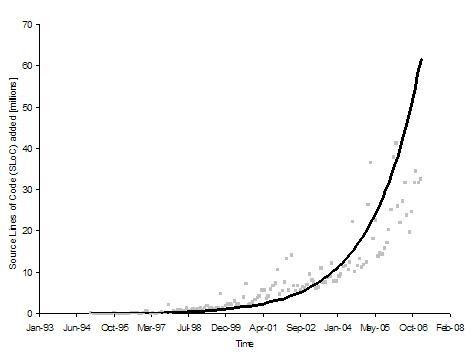

# How can Governments engage with moja global's open governance 
# Table of Contents

## Executive Summary
### Summary
moja global is capitalizing on open source development to produce tools that can support Measurement, Reporting, and Verification (MRV) systems for the Agriculture, Forestry and Other Land Use sector (AFOLU). Open source derives its strength from collaboration between users. This White Paper highlights that by sharing through open source, all parties gain. This is achieved through contributing to the understanding of open source practices in general and moja global procedures in particular. 

### Definitions
- **Open source** refers to software for which the source code is available. This allows anybody to inspect, modify, and distribute the software and derived products. Sharing the source code allows users to make improvements that are shared back with the community of users. The obligation to share back is often included in the licence of the open source project. 

- **Ecosystem** refers to all the users, contributors, businesses, service providers, resellers, reviewers, etc that interact with the software as well as with each other. The success of open source software is now measured by the strength of its ecosystem. Many of these people are paid by their company or organisation to work on the open source project. 

- **FLINT** (Full Lands Integration Tool) is an open source platform that integrates multiple data types (including remote sensing products) with FLINT-compatible modules to produce spatially-explicit calculations of greenhouse gas (GHG) emissions and removals as well as other variables. FLINT is designed to overcome some key challenges AFOLU MRV is facing, including: Reducing cost and expertise to design, implement and maintain AFOLU MRV. Providing a flexible framework for consistently combining components of the MRV system. Allowing iterative upgrading of components while maintaining the coherence of the overall system. Sharing lessons between new and experienced users without being forced to leapfrog to the most sophisticated version of the tool. 

- **moja global** is a project under the Linux Foundation that provides the technical and governance infrastructure that facilitates ecosystem collaboration on tools that contribute to sustainable land management. The FLINT is one of the software tools and other tools are welcomed. The Linux Foundation umbrella provides the legal entity, human resource management, accounting, and infrastructure.

### Use of open source and moja global tools
Open source is growing at an exponential rate and now 98% of all software is built on open source components. Open source is preferred because it:
- Delivers better quality, faster innovation, fewer bugs, more features
- Prevents vendor lock-in
- Can be customized and fixed by users
- Facilitates deployment and interoperability
- Has a better cost benefit ratio

Governments have some additional reasons to adopt open source tools:
- Open source collaboration reduces the demand on government experts 
- Open source reduces donor dependency and supports sustainability
- Open source provides access to advanced tools to governments who can't afford to develop bespoke systems
- Open source provides a transparent platform for public-private collaboration in the development of tools to support public policy needs

Companies have few remaining obstacles to open source adoption, mainly the lack of support and poor documentation. Governments seem to be slower in adopting open source tools because officials have a general lack of awareness of open source applications, its principles, its licensing, and its practices. Other barriers to adoption include employee resistance to leaving proprietary software, vendor lock-in, limited technical competence, and institutional barriers to updating policies regarding intellectual property. Many governments are developing policies regulating the use of open source software.

Anybody can download and use moja global software and learn how to use the tools. moja global develops documentation to facilitate this process and supports government institutions to improve their internal capacity to use and contribute to development of new or existing moja global tools. Some expertise is however required to compile the code, collect the necessary data inputs and to select and calibrate the modules. To start the process, some government institutions prefer to work with a service provider to speed up results and build capacity faster. The services can be provided through government to government collaboration or through a commercial contract. 

### Contribute to Open Source
Users of open source tools are also its contributors. Contributions can consist of coding, providing user feedback, reporting bugs, suggesting additional functionality, documentation of the code, support users, update the website, write minutes of meetings, write newsletters, etc. 

Contributors are primarily motivated by self interest. The advantages for contributors range from fixing bugs they struggle with, adding functionality they need, learning to understand the tools, reducing operational and maintenance cost, and growing a reputation as a tool expert.

Anybody can contribute to an open source project. Each project has its own procedures to manage collaboration but many open source projects follow similar steps: The contributor indicates interest to resolve an issue; copies the existing code (in case of software contribution) or text (in case of documentation contribution) into her/his own work area; makes the improvements she/he wants to propose; and offers the improvements back to the Project. The Project team reviews the proposed improvements and accepts or rejects them.

moja global is still developing its contribution procedures. At the moment the group of contributors is still relatively small and collaboration is informal. The repositories containing the code are currently semi-public, i.e. anybody can register to access the code but only registered contributors have access.

To gain optimally from open source, companies and governments have to establish open source contribution policies clarifying whether and how employees can contribute to open source projects, and who can approve the re-use of public IP (through open source licensing.)

### Manage Open Source
Contributors expect to have some influence over the technical and strategic decisions in return for their investment of time and effort. Hence an openHence open source governance system needs to allow contributors to participate in decision making. There are various models of open governance that have emerged from experience. 

moja global uses the governance model developed based on the experience of the Linux Foundation: Technical decisions are open to all and are made in a Technical Steering Committee (TSC) through concurrence of most active contributors. Strategic and financial decisions are made through voting by the people or organisations that have made a financial contribution (Strategy Board). The TSC and the Strategy Board have no hierarchical relationship. This allows for the two different governance systems to operate in parallel.

### Sharing Open Source
Most of the cost of an open source project isare covered by contributions in-kind. However, there are always some costs that need to be paid in cash. 

There are several methods of sharing the residual cost of an open source project: e.g. a voluntary contribution from users or a membership fee. Fairness is the key to a successful contribution system but perceptions may differ between communities. 

moja global is still exploring which system of cost sharing is perceived as fair by its users. Currently, moja global’s Strategy Board agrees on its strategic plan combined with an overview of all the inputs needed to achieve the strategic plan. The Board members allocate in-kind and cash contributions to achieve the strategic plan. The Board also commits to raise money through other channels. The principles of fairness and reciprocity are guiding the systems used to share the operational costs.

### Intellectual Property and open source licence
Every contributor owns and keeps the intellectual property (IP) related to the contribution made to an open source project but provides a licence to everybody allowing for the free reuse, change and distribution of the contribution. The IP of any open source project is thus owned by a wide range of contributors. This is a strength because it makes it almost impossible to reverse the decision to keep the source code open.

Various open source licences have emerged. Each licence serves a particular interest. moja global has released FLINT under the Mozilla Public Licence 2.0 (MPL 2.0). It ensures all users are contributing back to the project but it allows governments and companies to use the code for a wide range of uses including commercial applications. The MPL2.0 is very compatible with other licences and is recognized in many jurisdictions.

## Introduction
Many countries are moving to mitigate climate change through interventions in the land sector. International cooperation is emerging to assist countries with preparedness and payments for results. Despite considerable investments in preparedness, challenges with Measurement, Reporting, and Verification (MRV) systems remain a barrier to reducing net emissions from the land sector. A brief overview of the barriers is provided in Section 3. 

The Full Lands Integration Tool (FLINT) is open source software that can be combined with a range of modules to build MRV software for the Agriculture, Forestry and Other Land Use sector (AFOLU). The FLINT has been designed to mitigate or overcome the technical barriers faced by many countries. The FLINT is managed by the moja global project under the Linux Foundation. moja global’s open governance model tries to deal with some of the governance and capacity barriers countries are facing.

While open source software and governance offers a number of advantages over closed sourced systems, public institutions have not kept pace with its rapid adoption. In the private sector open source is now widely used. In governments, there is political support for open data and open source software, but government organisations have only just started to put policies in place that allow them to benefit from the advantages that open source offers. As a first step public officials need to understand the core concepts that define open source and open governance. 

To help interested parties to reap maximum benefits from engaging with moja global, this paper has been organized in the following chapters:
- the definition of open source, 
- why the public sector should use open source, 
- how the public sector can use and make in-kind contributions to open source projects, 
- how the public sector can  participate in steering the direction of open source projects, 
- how open source software communities share the cost of maintenance and coordination in a fair manner, and 
- how intellectual property (IP) rights are handled by open source projects.

## AFOLU MRV: Remaining barriers and possible solutions
Open source collaboration provides faster and more ingenious solutions for complex problems. AFOLU MRV is a complex undertaking and still faces some key challenges. The FLINT platform and its open source modules, are capitalizing on open source development to resolve the remaining AFOLU MRV challenges. This chapter provides an overview of the remaining AFOLU MRV challenges and how FLINT is dealing with them. This information serves as a general background about why moja global was established and why it sometimes differs from the most common practices in open source management.

### Remaining preparedness challenges
This section identifies the challenges countries face when including the land sector into their climate mitigation plans. The challenges are mentioned in various non-scientific reports, blogs and presentations. They are discussed in more detail in a [separate document](https://docs.google.com/document/d/1kYEX9_1LbEGN6Xi67V7IX9MzMN_B8ndtMNu9hXheQpk/edit?usp=sharing). The next section explains how the moja global AFOLU MRV software called FLINT is being designed to mitigate or overcome these barriers.

Through the Paris Agreement the importance of the land sector in mitigating climate change is recognised. Globally, Greenhouse Gas (GHG) emissions from the land sector account for about a quarter of all emissions. For many developing countries, the land sector represents well over 50% of total emissions and is the most obvious sector on which to focus their mitigation efforts. While much of this mitigation potential is from avoiding deforestation, there are also large benefits to be gained from reforestation and improved land management. Not surprisingly, most countries have included land sector targets into their Nationally Determined Contributions (NDCs).  

Developed countries and corporations are eager to assist countries to reduce GHG emissions through more sustainable land management and they have invested an impressive effort into country readiness i.e. helping countries to get systems in place to plan, implement, monitor, measure, report and verify emissions and sinks from the land sector. Despite more than USD 6 Billion of investment, the results are mixed and many challenges still remain in realising the abatement potential from the land sector. These challenges include:

Challenge 1: Ensure mitigation results meet the TACCC criteria:
The Paris agreement refers to the “TACCC” elements (Transparent, Accurate, Complete, Comparable and Consistent) for reporting greenhouse gas emission and removals.
 
Transparency is a challenge as documentation of data and methods must be complete enough to allow the results to be replicated by an independent third party. This is a challenge on the part of the host country as well as on the part of the third party responsible for verification. Studying and understanding a bespoke MRV system is very time consuming hence expensive. Standardization and open systems can reduce both cost and effort. 

Accuracy is improving with new data and methods becoming available almost daily. While data availability has been a significant barrier in the past, satellite imagery has become widely available and affordable, and can detect forest cover change at a granular scale. Similarly, estimates of carbon stock contained in forests are constantly are constantly improving. As more data becomes available and accessible, combining these various data sources in a coherent framework becomes the biggest challenge to accuracy. In recognition of this, there has been a shift in focus, to developing guiding principles for combining data and assessing uncertainties associated with monitoring approaches and how to reduce them.

Completeness of sources, sinks, and gases across all geographic areas is a challenge because with each additional land use and carbon pool, the complexity goes up exponentially. In many cases separate systems are developed for each land use and carbon pool. This can result in a large number of disparate systems that are difficult to manage and can often use similar, but not the same input data, leading to inconsistencies in the results. One system is needed to manage all gases and pools covering the whole geographic area.

Comparability is a challenge because of discrepancies between estimates, due to different conceptual and methodological approaches, inappropriate scale, lack of data on uncertainties, and limited guidance on how to and how not to use input data. This challenge will increase as more diverging methods, data and definitions emerge. Comparability can be enhanced by developing flexible systems that can adapt to national circumstances combined with the original data sources (preferably free and open data sets) and documenting methods of data production (preferably through peer-reviewed papers). Comparability can also be enhanced through clearly describing definitions, methodologies and assumptions to facilitate replication and assessment. Finally, comparability can profit from improved accuracy assessments and uncertainty analyses. 

Consistency is a challenge as updated data or methods require the recalculation of the whole time series starting from the base year (i.e. 10 or 20 years). Consistency is also essential when projecting the effect of policy options into the future. The effort of recalculating several decades of carbon flow estimates can only be kept manageable by automating the estimation process from end to end. This will not only reduce the effort, it will also reduce the potential of errors and increase transparency (as the old and new process can always be replicated).

Challenge 2: Ensure National, Sub-national and project estimates are consistent
The challenge is that projects or sub-national jurisdictions might have better data and estimation methods for the area under their control compared with the national MRV system. These better quality, independently verified results should be used to support the national accounts. Nesting verified project-results into national accounts will open up a range of avenues to compensate project owners and communities for their mitigation actions. It will increase confidence which in turn will stimulate private sector investment and maintain sustainable land use practices while ensuring the rigour around estimating emissions. Finally, nesting micro and meso levels into national accounts stimulates learning and innovation between these levels. 

Challenge 3: Moving from aspiration to implementation
The challenge is to ensure consistency between the mitigation planning and the emissions estimations. If the same system and data is used to plan and to measure, it is possible to measure real impacts of policy decisions. Moreover, policies can be tested on limited geographic areas. This allows for an iterative policy approach, tweaking and adjusting policies based on their effect on the ground. Testing various policy environments for different jurisdictions can speed up the learning process and identify the drivers of deforestation and other changes. 

Challenge 4: National capacity development
The challenge is to build sufficient capacity in each country to design, implement and manage every aspect of a functioning MRV. Most bespoke MRV systems in industrialised countries take many years to build drawing on existing experts and well established governance systems. Globally, there is just not enough expertise to repeat this effort in every country. Using an existing framework that is flexible enough to adapt to the local idiosyncrasies allows countries to focus on data collection, governance, consultation, ownership and incentives. 

Challenge 5: Increase government effectiveness
Effective land management practices require strong bureaucratic capacity, judicial oversight, market regulation and democratic accountability. No climate change program can introduce these requirements in case they are insufficient. Still, carefully selected approaches can have positive spillover effects including result based payments and iterative and agile programme management methods.

Challenge 6: Ensure benefits are shared equitably
The challenge is to manage land effectively while protecting rights and interests of local communities. Ownership and custodianship need to be established. All stakeholders need to be engaged and clear agreements established for distribution of reliably projected benefits. Effective conflict resolution methods are essential to deal with unavoidable disputes.

Challenge 7: Facilitate transition to long term regime:
The challenge is to design science based emission estimation tools to provide coherence between various and diverging policy frameworks and governance systems. Policy rules and administrative pressures can change if estimates are based on science. 

### Contributions from moja global and FLINT
FLINT is designed to help mitigate these remaining challenges. In Annex 1, the contribution of FLINT to each challenge is explained. Here only the key features are listed. Each feature may overcome several challenges: 

1. The FLINT provides a design and implementation framework: 
As much as an estimation tool, the FLINT is a framework that provides a structure for implementing AFOLU MRV systems. The framework is firm but it leaves a lot of flexibility for each user to fill out each building block of the framework with their preferred solution. Each country can, for example, select their remote sensing products or the models most appropriate for their area. The framework also defines relationships between the building blocks thus binding the system together. This in turn, allows for the calculation of uncertainty and sensitivity for the whole system. These building blocks can also be replaced with better options when new data becomes available. The sensitivity analysis helps to identify which improvement will have the biggest impact on the system as a whole. So the framework provides the structure for iterative improvements of data, models, governance and capacity. The framework reduces the amount of time needed for designing and documenting the MRV system. It also reduces the amount of duplication between countries without losing flexibility. 

2. The FLINT can deal with all land uses, all gases, and any stock and flow:
FLINT combined with the right modules meets the completeness criterion. By attaching the correct modules, the FLINT can deal with all land use types and all the transitions between these uses for all gases. Hence errors of omission and commission when changing land use are avoided. In addition, various co-benefits (e.g. biodiversity) can be calculated using the same system increasing the consistency between emissions and co-benefit estimations and predictions.

3. FLINT is modelling emissions and sinks:
The use of scientific models reduces overall costs by reducing the need for field observations. The models can be selected on the basis of a country’s specific needs. This makes the system very flexible. The modelling approach estimates real emissions and sinks first and applies policy rules afterwards. This allows policy rules to change or even apply different policy rules on one reliable underlying data set. Finally, a system based on models allows for the development of policy scenarios and projections into the future. Comparing the effect of various policies and interventions will improve land management decisions. It will also allow for the projection of potential benefits which in turn will facilitate negotiations between stakeholder groups.

4. FLINT delivers geographically specific results:
Each geographic unit (e.g. 30 by 30 meters) is processed separately. Hence all the results over time are also provided by geographic unitsunit and can be analysed separately. This means that areas can be calculated in a different manner and added up at the end. This allows seamless nesting of projects and sub-national accounts . It also allows geographic comparisons which allows for policy testing and for the identification of drivers of emissions. Finally, geo specificgeospecific results allow for negotiation and distribution of benefits to stakeholders by area and effort.

5. FLINT is fully automated:
FLINT processes a pixel through every time step and stores user specified results. This processing ensures that steps are traceable and repeated precisely the same way for each pixel. It also allows each calculation to be replicated or scenarios to be compared with reduced risk of errors. When new data or modules become available, the whole time series can easily be re-run. Finally, running an automated system can be learned more easily, making emissions estimation calculations accessible to more scientists and officials. 

6. FLINT is Open Source:
Since the advantages of open source are not well knownknow, this paper will elaborate in the chapters below. Here only a few advantages typical for AFOLU MRV are mentioned. First and foremost, open source makes the FLINT results comparable and verifiable. As many countries are using the same system and approach the results are based on the same scientific principles and assumptions (i.e. using comparable modules). So the results are comparable and, maybe more importantly, countries can learn from each other which approaches work best. Anybody can get access to the software and can thus replicate the results independently for verification. This is a huge advantage as donor countries or verification agencies can run their own version of FLINT and verify whether the data used generate the same results. The quality of the verification will go up considerably by ensuring claimants and verifiers use the same tool. This is also a good indicator for the commitment of claiming parties: if they are eager to use FLINT they are proving to be committed to reliable results, which will increase donor trust. 

7. Moja global is controlled through open governance:
Open governance needs more introduction which will be provided in the later chapters of this document. Here only a few salient points are listed: International collaboration speeds up development, advances TACCC, avoids duplication, reduces cost, and increasesincrease quality of the MRV tool. Similar systems used by several countries enableenables south-south exchange  and regional cooperation. Capacity can be built through collaboration and learning by doing and even if a country would lose all its existing capacity, there would be various (regional) entities that could step in to rebuild capacity.

## Open source is the new standard
moja global is standing on the shoulders of giants. It has released its tools under an open source licence because over time, software developers have learned that collaboration generates more benefits. This idea of open source is now well established in the business community and has progressed through different phases to the current sophisticated approach applied by the Linux Foundation. This Chapter explains open source (its definition, prevalence and evolution), the purpose of moja global and the role of the Linux Foundation.

### What is open source?
"Open source" refers to software for which the source code is available. This allows anybody to inspect, modify, and distribute the software and derived products. 

Open source proponents aim to promote collaboration and sharing by releasing their source code. As will be explained in the next chapter, this creates a learning environment where everybody fairly cooperates to speed up development and increase the quality of the software. This can be achieved if developers make it easy for others to reuse their work and if others reciprocate access to their source code.  

To regulate collaboration and reduce free-riding, open source licences have been developed. The licences have reached maturity and to qualify as an [open source licence ten conditions have to be met](https://opensource.org/osd-annotated). Conditions cover unconditional access to the source code and non-discrimination of downstream uses. Experience has taught coders that these conditions are essential to stimulate reuse and collaboration. 

On top of these minimum conditions licences vary considerably. Some licences just allow the unconditional use of the software for any purpose without requiring other developers to do the same. Other licences only allow the use of the source code on the condition that the user will release improvements and/or derived products under the same licence. The latter is called Copyleft, where copyright restricts the use and distribution, copyleft enforces the obligation to allow reuse and distribution. It gives every person who receives a copy of the work permission to reproduce, adapt, or distribute it, with the accompanying requirement that any resulting copies or adaptations are also bound by the same licensing agreement. 

While the term "open source" originated from software development, it has become a term that refers to anything that can be freely used and modified because its design is publicly accessible. Making designs freely available is not necessarily driven by a philanthropic motive. Most often, those releasing designs want to stimulate innovation and rapid development. Open source has thus become a way of managing product development that is based on sharing information, transparency, collaboration, and iterative improvement.

### Prevalence of open source products
Open source is now the norm in software development measured by the increased number of open source projects and the increase of software built on top of open source software. For the first indicator, the total amount of source code as well as the total number of open source projects is growing at an exponential rate. 

