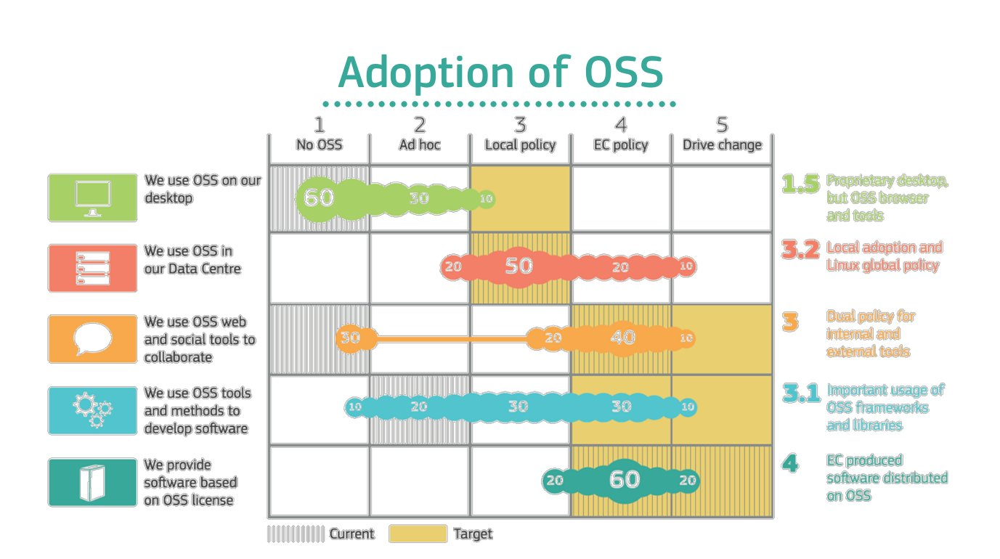
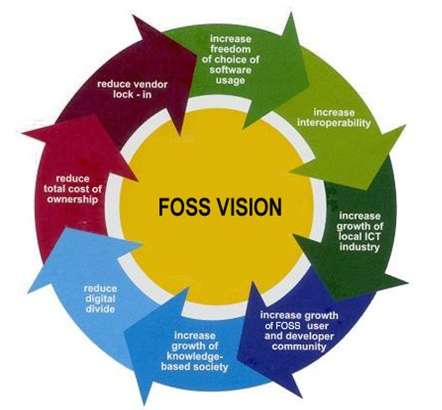
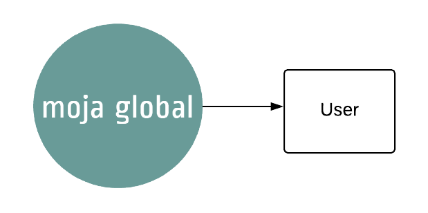
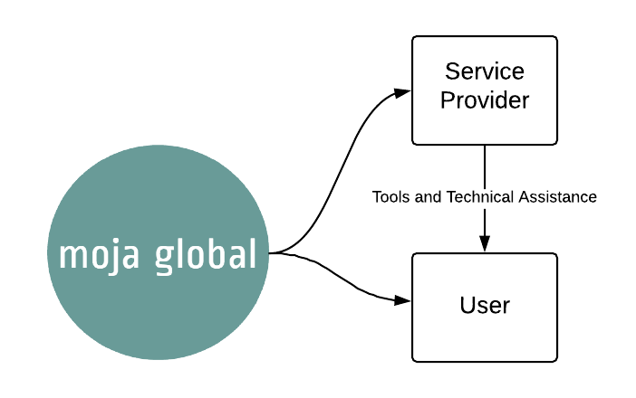
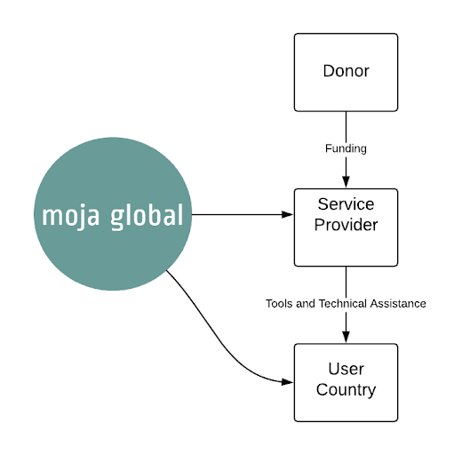
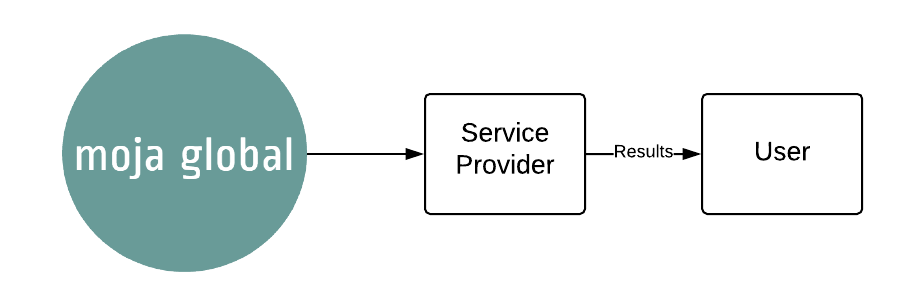
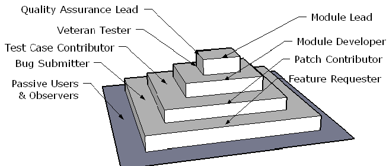
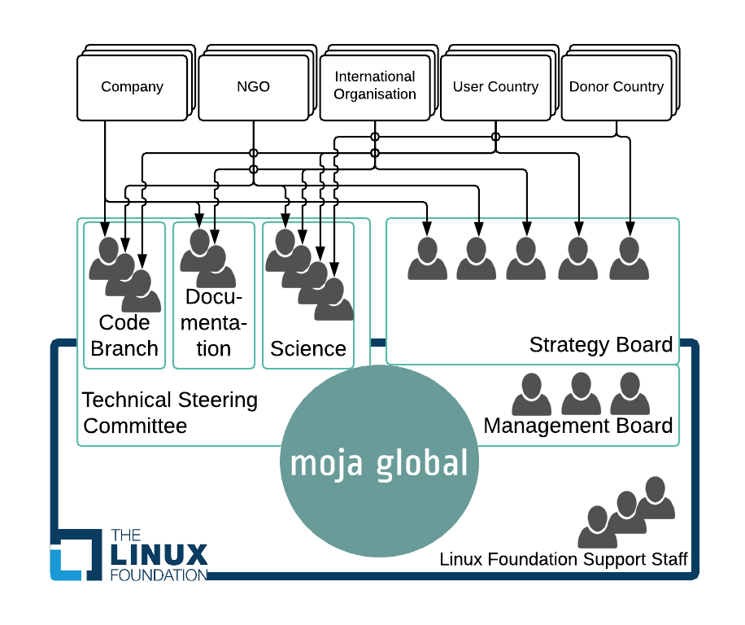

# How can Governments engage with moja global's open governance 
# Table of Contents

## Executive Summary
### Summary
moja global is capitalizing on open source development to produce tools that can support Measurement, Reporting, and Verification (MRV) systems for the Agriculture, Forestry and Other Land Use sector (AFOLU). Open source derives its strength from collaboration between users. This White Paper highlights that by sharing through open source, all parties gain. This is achieved through contributing to the understanding of open source practices in general and moja global procedures in particular. 

### Definitions
- **Open source** refers to software for which the source code is available. This allows anybody to inspect, modify, and distribute the software and derived products. Sharing the source code allows users to make improvements that are shared back with the community of users. The obligation to share back is often included in the licence of the open source project. 

- **Ecosystem** refers to all the users, contributors, businesses, service providers, resellers, reviewers, etc that interact with the software as well as with each other. The success of open source software is now measured by the strength of its ecosystem. Many of these people are paid by their company or organisation to work on the open source project. 

- **FLINT** (Full Lands Integration Tool) is an open source platform that integrates multiple data types (including remote sensing products) with FLINT-compatible modules to produce spatially-explicit calculations of greenhouse gas (GHG) emissions and removals as well as other variables. FLINT is designed to overcome some key challenges AFOLU MRV is facing, including: Reducing cost and expertise to design, implement and maintain AFOLU MRV. Providing a flexible framework for consistently combining components of the MRV system. Allowing iterative upgrading of components while maintaining the coherence of the overall system. Sharing lessons between new and experienced users without being forced to leapfrog to the most sophisticated version of the tool. 

- **moja global** is a project under the Linux Foundation that provides the technical and governance infrastructure that facilitates ecosystem collaboration on tools that contribute to sustainable land management. The FLINT is one of the software tools and other tools are welcomed. The Linux Foundation umbrella provides the legal entity, human resource management, accounting, and infrastructure.

### Use of open source and moja global tools
Open source is growing at an exponential rate and now 98% of all software is built on open source components. Open source is preferred because it:
- Delivers better quality, faster innovation, fewer bugs, more features
- Prevents vendor lock-in
- Can be customized and fixed by users
- Facilitates deployment and interoperability
- Has a better cost benefit ratio

Governments have some additional reasons to adopt open source tools:
- Open source collaboration reduces the demand on government experts 
- Open source reduces donor dependency and supports sustainability
- Open source provides access to advanced tools to governments who can't afford to develop bespoke systems
- Open source provides a transparent platform for public-private collaboration in the development of tools to support public policy needs

Companies have few remaining obstacles to open source adoption, mainly the lack of support and poor documentation. Governments seem to be slower in adopting open source tools because officials have a general lack of awareness of open source applications, its principles, its licensing, and its practices. Other barriers to adoption include employee resistance to leaving proprietary software, vendor lock-in, limited technical competence, and institutional barriers to updating policies regarding intellectual property. Many governments are developing policies regulating the use of open source software.

Anybody can download and use moja global software and learn how to use the tools. moja global develops documentation to facilitate this process and supports government institutions to improve their internal capacity to use and contribute to development of new or existing moja global tools. Some expertise is however required to compile the code, collect the necessary data inputs and to select and calibrate the modules. To start the process, some government institutions prefer to work with a service provider to speed up results and build capacity faster. The services can be provided through government to government collaboration or through a commercial contract. 

### Contribute to Open Source
Users of open source tools are also its contributors. Contributions can consist of coding, providing user feedback, reporting bugs, suggesting additional functionality, documentation of the code, support users, update the website, write minutes of meetings, write newsletters, etc. 

Contributors are primarily motivated by self interest. The advantages for contributors range from fixing bugs they struggle with, adding functionality they need, learning to understand the tools, reducing operational and maintenance cost, and growing a reputation as a tool expert.

Anybody can contribute to an open source project. Each project has its own procedures to manage collaboration but many open source projects follow similar steps: The contributor indicates interest to resolve an issue; copies the existing code (in case of software contribution) or text (in case of documentation contribution) into her/his own work area; makes the improvements she/he wants to propose; and offers the improvements back to the Project. The Project team reviews the proposed improvements and accepts or rejects them.

moja global is still developing its contribution procedures. At the moment the group of contributors is still relatively small and collaboration is informal. The repositories containing the code are currently semi-public, i.e. anybody can register to access the code but only registered contributors have access.

To gain optimally from open source, companies and governments have to establish open source contribution policies clarifying whether and how employees can contribute to open source projects, and who can approve the re-use of public IP (through open source licensing.)

### Manage Open Source
Contributors expect to have some influence over the technical and strategic decisions in return for their investment of time and effort. Hence an openHence open source governance system needs to allow contributors to participate in decision making. There are various models of open governance that have emerged from experience. 

moja global uses the governance model developed based on the experience of the Linux Foundation: Technical decisions are open to all and are made in a Technical Steering Committee (TSC) through concurrence of most active contributors. Strategic and financial decisions are made through voting by the people or organisations that have made a financial contribution (Strategy Board). The TSC and the Strategy Board have no hierarchical relationship. This allows for the two different governance systems to operate in parallel.

### Sharing Open Source
Most of the cost of an open source project isare covered by contributions in-kind. However, there are always some costs that need to be paid in cash. 

There are several methods of sharing the residual cost of an open source project: e.g. a voluntary contribution from users or a membership fee. Fairness is the key to a successful contribution system but perceptions may differ between communities. 

moja global is still exploring which system of cost sharing is perceived as fair by its users. Currently, moja global’s Strategy Board agrees on its strategic plan combined with an overview of all the inputs needed to achieve the strategic plan. The Board members allocate in-kind and cash contributions to achieve the strategic plan. The Board also commits to raise money through other channels. The principles of fairness and reciprocity are guiding the systems used to share the operational costs.

### Intellectual Property and open source licence
Every contributor owns and keeps the intellectual property (IP) related to the contribution made to an open source project but provides a licence to everybody allowing for the free reuse, change and distribution of the contribution. The IP of any open source project is thus owned by a wide range of contributors. This is a strength because it makes it almost impossible to reverse the decision to keep the source code open.

Various open source licences have emerged. Each licence serves a particular interest. moja global has released FLINT under the Mozilla Public Licence 2.0 (MPL 2.0). It ensures all users are contributing back to the project but it allows governments and companies to use the code for a wide range of uses including commercial applications. The MPL2.0 is very compatible with other licences and is recognized in many jurisdictions.

## Introduction
Many countries are moving to mitigate climate change through interventions in the land sector. International cooperation is emerging to assist countries with preparedness and payments for results. Despite considerable investments in preparedness, challenges with Measurement, Reporting, and Verification (MRV) systems remain a barrier to reducing net emissions from the land sector. A brief overview of the barriers is provided in Section 3. 

The Full Lands Integration Tool (FLINT) is open source software that can be combined with a range of modules to build MRV software for the Agriculture, Forestry and Other Land Use sector (AFOLU). The FLINT has been designed to mitigate or overcome the technical barriers faced by many countries. The FLINT is managed by the moja global project under the Linux Foundation. moja global’s open governance model tries to deal with some of the governance and capacity barriers countries are facing.

While open source software and governance offers a number of advantages over closed sourced systems, public institutions have not kept pace with its rapid adoption. In the private sector open source is now widely used. In governments, there is political support for open data and open source software, but government organisations have only just started to put policies in place that allow them to benefit from the advantages that open source offers. As a first step public officials need to understand the core concepts that define open source and open governance. 

To help interested parties to reap maximum benefits from engaging with moja global, this paper has been organized in the following chapters:
- the definition of open source, 
- why the public sector should use open source, 
- how the public sector can use and make in-kind contributions to open source projects, 
- how the public sector can  participate in steering the direction of open source projects, 
- how open source software communities share the cost of maintenance and coordination in a fair manner, and 
- how intellectual property (IP) rights are handled by open source projects.

## AFOLU MRV: Remaining barriers and possible solutions
Open source collaboration provides faster and more ingenious solutions for complex problems. AFOLU MRV is a complex undertaking and still faces some key challenges. The FLINT platform and its open source modules, are capitalizing on open source development to resolve the remaining AFOLU MRV challenges. This chapter provides an overview of the remaining AFOLU MRV challenges and how FLINT is dealing with them. This information serves as a general background about why moja global was established and why it sometimes differs from the most common practices in open source management.

### Remaining preparedness challenges
This section identifies the challenges countries face when including the land sector into their climate mitigation plans. The challenges are mentioned in various non-scientific reports, blogs and presentations. They are discussed in more detail in a [separate document](https://docs.google.com/document/d/1kYEX9_1LbEGN6Xi67V7IX9MzMN_B8ndtMNu9hXheQpk/edit?usp=sharing). The next section explains how the moja global AFOLU MRV software called FLINT is being designed to mitigate or overcome these barriers.

Through the Paris Agreement the importance of the land sector in mitigating climate change is recognised. Globally, Greenhouse Gas (GHG) emissions from the land sector account for about a quarter of all emissions. For many developing countries, the land sector represents well over 50% of total emissions and is the most obvious sector on which to focus their mitigation efforts. While much of this mitigation potential is from avoiding deforestation, there are also large benefits to be gained from reforestation and improved land management. Not surprisingly, most countries have included land sector targets into their Nationally Determined Contributions (NDCs).  

Developed countries and corporations are eager to assist countries to reduce GHG emissions through more sustainable land management and they have invested an impressive effort into country readiness i.e. helping countries to get systems in place to plan, implement, monitor, measure, report and verify emissions and sinks from the land sector. Despite more than USD 6 Billion of investment, the results are mixed and many challenges still remain in realising the abatement potential from the land sector. These challenges include:

Challenge 1: Ensure mitigation results meet the TACCC criteria:
The Paris agreement refers to the “TACCC” elements (Transparent, Accurate, Complete, Comparable and Consistent) for reporting greenhouse gas emission and removals.
 
Transparency is a challenge as documentation of data and methods must be complete enough to allow the results to be replicated by an independent third party. This is a challenge on the part of the host country as well as on the part of the third party responsible for verification. Studying and understanding a bespoke MRV system is very time consuming hence expensive. Standardization and open systems can reduce both cost and effort. 

Accuracy is improving with new data and methods becoming available almost daily. While data availability has been a significant barrier in the past, satellite imagery has become widely available and affordable, and can detect forest cover change at a granular scale. Similarly, estimates of carbon stock contained in forests are constantly are constantly improving. As more data becomes available and accessible, combining these various data sources in a coherent framework becomes the biggest challenge to accuracy. In recognition of this, there has been a shift in focus, to developing guiding principles for combining data and assessing uncertainties associated with monitoring approaches and how to reduce them.

Completeness of sources, sinks, and gases across all geographic areas is a challenge because with each additional land use and carbon pool, the complexity goes up exponentially. In many cases separate systems are developed for each land use and carbon pool. This can result in a large number of disparate systems that are difficult to manage and can often use similar, but not the same input data, leading to inconsistencies in the results. One system is needed to manage all gases and pools covering the whole geographic area.

Comparability is a challenge because of discrepancies between estimates, due to different conceptual and methodological approaches, inappropriate scale, lack of data on uncertainties, and limited guidance on how to and how not to use input data. This challenge will increase as more diverging methods, data and definitions emerge. Comparability can be enhanced by developing flexible systems that can adapt to national circumstances combined with the original data sources (preferably free and open data sets) and documenting methods of data production (preferably through peer-reviewed papers). Comparability can also be enhanced through clearly describing definitions, methodologies and assumptions to facilitate replication and assessment. Finally, comparability can profit from improved accuracy assessments and uncertainty analyses. 

Consistency is a challenge as updated data or methods require the recalculation of the whole time series starting from the base year (i.e. 10 or 20 years). Consistency is also essential when projecting the effect of policy options into the future. The effort of recalculating several decades of carbon flow estimates can only be kept manageable by automating the estimation process from end to end. This will not only reduce the effort, it will also reduce the potential of errors and increase transparency (as the old and new process can always be replicated).

Challenge 2: Ensure National, Sub-national and project estimates are consistent
The challenge is that projects or sub-national jurisdictions might have better data and estimation methods for the area under their control compared with the national MRV system. These better quality, independently verified results should be used to support the national accounts. Nesting verified project-results into national accounts will open up a range of avenues to compensate project owners and communities for their mitigation actions. It will increase confidence which in turn will stimulate private sector investment and maintain sustainable land use practices while ensuring the rigour around estimating emissions. Finally, nesting micro and meso levels into national accounts stimulates learning and innovation between these levels. 

Challenge 3: Moving from aspiration to implementation
The challenge is to ensure consistency between the mitigation planning and the emissions estimations. If the same system and data is used to plan and to measure, it is possible to measure real impacts of policy decisions. Moreover, policies can be tested on limited geographic areas. This allows for an iterative policy approach, tweaking and adjusting policies based on their effect on the ground. Testing various policy environments for different jurisdictions can speed up the learning process and identify the drivers of deforestation and other changes. 

Challenge 4: National capacity development
The challenge is to build sufficient capacity in each country to design, implement and manage every aspect of a functioning MRV. Most bespoke MRV systems in industrialised countries take many years to build drawing on existing experts and well established governance systems. Globally, there is just not enough expertise to repeat this effort in every country. Using an existing framework that is flexible enough to adapt to the local idiosyncrasies allows countries to focus on data collection, governance, consultation, ownership and incentives. 

Challenge 5: Increase government effectiveness
Effective land management practices require strong bureaucratic capacity, judicial oversight, market regulation and democratic accountability. No climate change program can introduce these requirements in case they are insufficient. Still, carefully selected approaches can have positive spillover effects including result based payments and iterative and agile programme management methods.

Challenge 6: Ensure benefits are shared equitably
The challenge is to manage land effectively while protecting rights and interests of local communities. Ownership and custodianship need to be established. All stakeholders need to be engaged and clear agreements established for distribution of reliably projected benefits. Effective conflict resolution methods are essential to deal with unavoidable disputes.

Challenge 7: Facilitate transition to long term regime:
The challenge is to design science based emission estimation tools to provide coherence between various and diverging policy frameworks and governance systems. Policy rules and administrative pressures can change if estimates are based on science. 

### Contributions from moja global and FLINT
FLINT is designed to help mitigate these remaining challenges. In Annex 1, the contribution of FLINT to each challenge is explained. Here only the key features are listed. Each feature may overcome several challenges: 

1. The FLINT provides a design and implementation framework: 
As much as an estimation tool, the FLINT is a framework that provides a structure for implementing AFOLU MRV systems. The framework is firm but it leaves a lot of flexibility for each user to fill out each building block of the framework with their preferred solution. Each country can, for example, select their remote sensing products or the models most appropriate for their area. The framework also defines relationships between the building blocks thus binding the system together. This in turn, allows for the calculation of uncertainty and sensitivity for the whole system. These building blocks can also be replaced with better options when new data becomes available. The sensitivity analysis helps to identify which improvement will have the biggest impact on the system as a whole. So the framework provides the structure for iterative improvements of data, models, governance and capacity. The framework reduces the amount of time needed for designing and documenting the MRV system. It also reduces the amount of duplication between countries without losing flexibility. 

2. The FLINT can deal with all land uses, all gases, and any stock and flow:
FLINT combined with the right modules meets the completeness criterion. By attaching the correct modules, the FLINT can deal with all land use types and all the transitions between these uses for all gases. Hence errors of omission and commission when changing land use are avoided. In addition, various co-benefits (e.g. biodiversity) can be calculated using the same system increasing the consistency between emissions and co-benefit estimations and predictions.

3. FLINT is modelling emissions and sinks:
The use of scientific models reduces overall costs by reducing the need for field observations. The models can be selected on the basis of a country’s specific needs. This makes the system very flexible. The modelling approach estimates real emissions and sinks first and applies policy rules afterwards. This allows policy rules to change or even apply different policy rules on one reliable underlying data set. Finally, a system based on models allows for the development of policy scenarios and projections into the future. Comparing the effect of various policies and interventions will improve land management decisions. It will also allow for the projection of potential benefits which in turn will facilitate negotiations between stakeholder groups.

4. FLINT delivers geographically specific results:
Each geographic unit (e.g. 30 by 30 meters) is processed separately. Hence all the results over time are also provided by geographic unitsunit and can be analysed separately. This means that areas can be calculated in a different manner and added up at the end. This allows seamless nesting of projects and sub-national accounts . It also allows geographic comparisons which allows for policy testing and for the identification of drivers of emissions. Finally, geo specificgeospecific results allow for negotiation and distribution of benefits to stakeholders by area and effort.

5. FLINT is fully automated:
FLINT processes a pixel through every time step and stores user specified results. This processing ensures that steps are traceable and repeated precisely the same way for each pixel. It also allows each calculation to be replicated or scenarios to be compared with reduced risk of errors. When new data or modules become available, the whole time series can easily be re-run. Finally, running an automated system can be learned more easily, making emissions estimation calculations accessible to more scientists and officials. 

6. FLINT is Open Source:
Since the advantages of open source are not well knownknow, this paper will elaborate in the chapters below. Here only a few advantages typical for AFOLU MRV are mentioned. First and foremost, open source makes the FLINT results comparable and verifiable. As many countries are using the same system and approach the results are based on the same scientific principles and assumptions (i.e. using comparable modules). So the results are comparable and, maybe more importantly, countries can learn from each other which approaches work best. Anybody can get access to the software and can thus replicate the results independently for verification. This is a huge advantage as donor countries or verification agencies can run their own version of FLINT and verify whether the data used generate the same results. The quality of the verification will go up considerably by ensuring claimants and verifiers use the same tool. This is also a good indicator for the commitment of claiming parties: if they are eager to use FLINT they are proving to be committed to reliable results, which will increase donor trust. 

7. Moja global is controlled through open governance:
Open governance needs more introduction which will be provided in the later chapters of this document. Here only a few salient points are listed: International collaboration speeds up development, advances TACCC, avoids duplication, reduces cost, and increasesincrease quality of the MRV tool. Similar systems used by several countries enableenables south-south exchange  and regional cooperation. Capacity can be built through collaboration and learning by doing and even if a country would lose all its existing capacity, there would be various (regional) entities that could step in to rebuild capacity.

## Open source is the new standard
moja global is standing on the shoulders of giants. It has released its tools under an open source licence because over time, software developers have learned that collaboration generates more benefits. This idea of open source is now well established in the business community and has progressed through different phases to the current sophisticated approach applied by the Linux Foundation. This Chapter explains open source (its definition, prevalence and evolution), the purpose of moja global and the role of the Linux Foundation.

### What is open source?
"Open source" refers to software for which the source code is available. This allows anybody to inspect, modify, and distribute the software and derived products. 

Open source proponents aim to promote collaboration and sharing by releasing their source code. As will be explained in the next chapter, this creates a learning environment where everybody fairly cooperates to speed up development and increase the quality of the software. This can be achieved if developers make it easy for others to reuse their work and if others reciprocate access to their source code.  

To regulate collaboration and reduce free-riding, open source licences have been developed. The licences have reached maturity and to qualify as an [open source licence ten conditions have to be met](https://opensource.org/osd-annotated). Conditions cover unconditional access to the source code and non-discrimination of downstream uses. Experience has taught coders that these conditions are essential to stimulate reuse and collaboration. 

On top of these minimum conditions licences vary considerably. Some licences just allow the unconditional use of the software for any purpose without requiring other developers to do the same. Other licences only allow the use of the source code on the condition that the user will release improvements and/or derived products under the same licence. The latter is called Copyleft, where copyright restricts the use and distribution, copyleft enforces the obligation to allow reuse and distribution. It gives every person who receives a copy of the work permission to reproduce, adapt, or distribute it, with the accompanying requirement that any resulting copies or adaptations are also bound by the same licensing agreement. 

While the term "open source" originated from software development, it has become a term that refers to anything that can be freely used and modified because its design is publicly accessible. Making designs freely available is not necessarily driven by a philanthropic motive. Most often, those releasing designs want to stimulate innovation and rapid development. Open source has thus become a way of managing product development that is based on sharing information, transparency, collaboration, and iterative improvement.

### Prevalence of open source products
Open source is now the norm in software development measured by the increased number of open source projects and the increase of software built on top of open source software. For the first indicator, the total amount of source code as well as the total number of open source projects is growing at an exponential rate. 

Open Source is also the foundation for nearly all software. [Audits prove that 98% of all software](https://docs.google.com/viewer?url=http%3A%2F%2Fwww.roguewave.com%2Fgetmedia%2F2282b1ca-50a7-472f-a881-43fef139f56e%2Froguewave-open-source-support-report2017-vf4-digital.pdf) is built on some open source components. Moreover, these audits also show that in about 82% of the cases copyleft licenses are used requiring the new product to be open source too. This is driving the spread of open source and as a result [65% of the companies interviewed by BlackDuck](https://www.blackducksoftware.com/2016-future-of-open-source) indicate that their use of open source software has increased. 

A more recent trend is that governments are adopting open source software. Below an example is provided for the EU institutions. The adoption of open source licences is most advanced for software developed by the EU. Open source software has also been adopted in data centers as the industry standard. Desktop software and social tools are still controlled by proprietary software. As explained below, governments are adopting open source policies to encourage the full adoption and benefits of open source software. Open data has taken off even more rapidly and combined with open source software, they are likely to transform government.

Linux is the world’s largest open source software project. The Linux kernel is the core component of the Linux operating system and is charged with managing the hardware, running user programs, and maintaining the security and integrity of the whole system. Linux has become the world’s most dominant operating system, with massive adoption in almost every sector: 95%+ of the top 1M web domains; 80%+ of smartphones run Android (based on the Linux kernel); 98%+ of the top 500 fastest supercomputers in the world; most of the global markets, including NYSE, NASDAQ, London Exchange, Tokyo Stock Exchange; etc.

Many open source softwares have household names: WordPress is the world’s most popular blogging platform, used by a staggering 202 million websites. Magento  is the world’s fastest growing e-commerce platform used by 30,000 merchants including Samsung, Nespresso and The North Face. Firefox currently accounts for 24% of the recorded usage share of web browsers, and this figure is on the rise. Open source has penetrated really every field from accounting to artificial intelligence. 

### How does open source work?
In parallel with open source software, open source collaboration practices have rapidly evolved from hands off code dumps, sometimes described as the couch-by-the-roadside model, to sophisticated, and well managed structures such as the Linux Foundation model. 

Couch by the roadside:
Some developers publish their code on the internet and just hope that somebody will pick it up and find it useful. This is often done with code that the owner no longer uses much like an old couch one no longer needs and put by the roadside for anyone to take. Someone will find the code, might improve it and put it by the roadside again. As a result there will be various versions of the software, each developing in a different direction. The coders are not really exchanging ideas, let alone collaborating on the implementation of these ideas.

Actively managed code:
To improve collaboration, the coder who wrote the first version, can actively manage the code: This involves publishing the source code and inviting others to provide feedback. The feedback can include identification of bugs, proposing solutions for bugs, or suggesting new features and functionality. The owner will receive and publish the bugs, accept or reject the solutions, and build additional features. This level of collaboration requires a system to communicate with the owner, systems to track bugs, lists of requested features, standard testing procedures to ensure the software still works after changes have been made, good documentation for users to understand the software and well written software so it is easy to understand. Platforms like Github have emerged to provide these services. This approach has some drawbacks.  A project will quickly become dependent on the manager of the project, this puts an enormous burden on the central person and it puts the sustainability of the project at risk.

Collaborative open source development:
To reduce the dependency on one person, coders started to organize in teams, dividing the tasks and responsibilities. Going from one manager to a team is a challenge for two reasons: the team needs a shared infrastructure (hosting, build servers, issue trackers, etc.) and it needs procedures (accepting bug reports, patches, features, releases, etc.). Shared infrastructure is available and therefore only needs systems to share the infrastructure costs. More challenging are procedures for a team without hierarchy, spread across numerous locations and time zones, with different priorities and with a varying number of working hours to invest. Over time, open source teams developed structures and systems that can deal with these challenges. The management structures support the open organisation by being user focused, democratic and meritocratic. 

Building a Community:
The success of open source software can be measured by the strength of its community: i.e. people who invest their time and intellect to make contributions: these people can report bugs, develop code, review and test code, write documentation, etc. Once a community builds around a project, a virtuous cycle keeps increasing the benefits. Developers are encouraged by sustainable open source ecosystems, which results in better quality software. This in turn attracts users who create value with the software and are willing to free up resources to make contributions to the software. As these communities grow, evolve and enjoy success, financial and in-kind resources are funneled back into the further development of the projects for the benefit of all. To build a strong community, open source software communities try to make it easy for contributors to find out what needs doing, to obtain good documentation, to understand processes, and have a voice in the management of the software. Most contributors work on the issues they are passionate about or would like to see solved. Unfortunately, some unpopular tasks (e.g. documentation) sometimes fall behind. This was the next challenge to resolve.

From volunteers to paid contributors:
When companies wanted to use open source software in their products, they had a stake in its quality and decided to join the communities around open source software. The companies pay their developers to work on the open source software. Rather than competing, companies collaborate on software development. As a result, the quality and innovation of open source software increases. For example, 13,594 developers from at least 1,340 companies have contributed to the Linux kernel since 2005. The Linux kernel community merged changes at an average rate of 7.8 patches per hour over the past 15 months. So a new major kernel release occurs every 9 to 10 weeks. Business models adapted, rather than selling software companies provide service and support related to the software but the software is open source. The company Red Hat took the open-source Linux operating system and made a business out of customizing it and supporting it. Red Hat’s revenue was about USD 6 million in 1998, now 20 years later its revenue has jumped to more than USD 2 billion. Red Hat has an enormous commercial interest to invest in open source Linux and its community. 

Collaboration under an umbrella:
Shared infrastructure and a community requires a system to share cost, joint accounting and a legal entity to receive funds. Initially open source projects established themselves as individual non-profit organisations. But soon it became clear that collaborating on a joint legal umbrella made collaboration easier and more efficient. As with open source software, umbrella organisations allowed projects to learn from each other and innovate rapidly. Various umbrella organizations exist like The Linux Foundation, Eclipse Foundation, and Apache Software Foundation. Each has its own flavour and focus. 

### How does moja global work?
moja global provides a home for credible software that contributes to sustainable land management. The FLINT is one of the software tools. moja global welcomes other open-source tools that contribute to sustainable land management. 

moja global focuses on making it possible for contributors to collaborate by providing the technical and governance infrastructure to collaborate on tools. The core activities of moja global are legally defined in its charter. Simplified they are:
- Facilitate the continuous development of tools;
- Foster an ecosystem;
- Ensure operational resources are available (financial and in-kind support);
- Pursue independent certification systems for software or technical skills;  
- Host the infrastructure for moja global software; 
- Provide neutral home for collaboration on tools (infrastructure, strategy, meetings, events and discussions);
- Maintain and operate open governance of moja global.

moja global is an open source project under The Linux Foundation umbrella. The Linux Foundation provides the legal entity, human resource management, accounting, and infrastructure (More below).

moja global is facilitating the collaboration on the software between various users and contributors. Some users might download and install the software themselves as they have the expertise to do so. Other users might prefer to use the services of a company or organisation that can install and customise the software, support the data management systems and provide advice on the governance of the overall system. Finally, there might be entities that use the software to verify the results reported by users. They will independently obtain their version of the software and run it using the data provided by the user. Various other types of interactions are possible.  

### How does The Linux Foundation work?
The Linux Foundation, the umbrella organisation of moja global, is dedicated to building sustainable ecosystems around open source projects. The Linux Foundation has specialised in providing the effective processes of coordination for open-source projects. 

The Linux Foundation has launched more than 100 collaborative projects. Each of these projects has adopted an open governance structure customized to the needs of each community but based upon core principles of open source. The feedback and experience of these projects has informed improvements to the open governance system. In some ways the Linux Foundation can be considered an open source project developing open mechanisms for collaboration.

Key inputs The Linux Foundation provides include thought leadership, governance for collaboration, infrastructure, services, events, and training. 

## Using open source software
moja global has released its tools under an open source licence using state-of-the-art licensing and support systems. Now it is up to governments, organisations and companies to use the software. As stated in the previous Chapter, 98% of surveyed software uses open source components. There are good reasons for companies to use open source including quality and innovation. This Chapter elaborates on the advantages of using open source as well as on the reasons why sometimes open source is not used in particular by governments. A few risks are listed. Governments are establishing policies to ensure open source is getting equal treatment or even preference over other software. Finally, this Chapter will explain how interested governments can start using moja global tools like FLINT, as it requires more than only downloading the software. FLINT has to be combined with compatible Modules and data. Most Governments find it useful to ask for the help of a service provider to get started with using the FLINT.

### Why use open source software?
A large majority, 76 percent, of system administrators in large enterprises indicate they prefer to use open-source software whenever possible. The reason for using open source software has changed as the software and the management systems matured. Some perceptions persist (e.g. open source is cheaper) but in reality they have been overtaken by completely different reasons (e.g. easier to deploy). Below the current reasons for using open source software have been listed:

Quality of the software: 
The quality of the software is the most important reason for companies to use open source software when it is available. The most telling example is probably the decision of Microsoft some years ago to use Linux to run some of its own operations. The quality of the open source software is mainly a result from the pooling of resources from various companies who would otherwise be competing as well as the diversity of the contributors. Open source code management systems have also overtaken private systems as open source code has far fewer bugs at the time the code is accepted.

Freedom from vendor lock-in:
From the early years onwards, fear for vendor lock-in has been an important reason for using open source software. Still, vendor lock-in has been such a standard part of enterprise IT over the years that it often goes unnoticed and unquestioned. Cloud computing has pushed vendor lock-in back to the top of the agenda. To ensure that data centers are really a service that can be discontinued, portability of the system between data center vendors is crucial. Moreover, open source allows adjustments to the software when the selected technology stack is not 100% compatible. 

Innovation, competitive features and technical capabilities:
Speed of innovation is now a prime reason to adopt open source software. High speed innovation used to be reserved for the open source projects that reached a tipping point:   
Open Source projects exhibit natural increasing returns to scale. That’s because most developers are interested in using and participating in the largest projects, and the projects with the most developers are more likely to quickly fix bugs, add features and work reliably across the largest number of platforms. Due to a better understanding of the open source environment, companies now organise for fast innovation by building a coalition of key players from the start. OpenStack and HyperLedger are projects that brought in the top industry players from the start and created an environment for innovation that could not be matched by proprietary software.

Ability to customize and fix:
Access to the source code obviously allows for changes made in house. These customizations allow companies to adjust software to their needs without going back to the vendor.

Easy deployment and interoperability:
Open source software has become more user friendly over the years. There is a steep increase in respondents that indicated that open-source software was easier to deploy. Interoperability also improved. With enterprise wide software integration, every company now has a technology stack that needs to communicate with every package. When some communication problems arise, it is possible that two vendors need to be in touch to resolve the issue. This can be very challenging. Open source software allows the company coders to find and resolve communication problems between software packages. 

Cost benefit:
This still is a consideration. Most companies understand that open source software is not free like in a free meal but free like in free speech. As explained below, they are committed to make a contribution through memberships as well as in-kind. But those contributions are still much more efficient than what is provided by proprietary software. So while not for free, open source offers a much better cost benefit compared to proprietary software.

### Why do governments use open source software?
There are few studies that have analysed the reasons why governments use (or do not use) open source software. Government awareness of the advantages of open source seems to be on the rise but the existing administrative procedures are not necessarily conducive for the adoption of open source solutions. This seems to be in line with the preliminary results from the small survey done in preparation of this paper. 

Governments use open source for the same reasons as companies do but the emphasis might be slightly different. It seems that the cost-benefit balance for open source is still the main reason for selecting open source software, followed by better support from a community, no vendor lock-in, the ability to customise and transparency of the operation of the software. 

For governments supporting the use of quality MRV systems, there are some specific advantages of using open source solutions;

Collaboration instead of Competition: 
Globally, the expertise available to develop advanced MRV systems is limited. There are not enough experts to develop and implement several competing tools. Meanwhile, countries are calling urgently for these tools so they can plan their interventions, access funding and reduce emissions. Open-source allows experts to collaborate on the same tool without having to bring them to the same organisations or company. Any improvements are available to everybody, which will speed up innovation. Feedback from users will increase the experience base that can drive improvements. Duplication of effort is reduced and the quality of solutions goes up due to the diversity of the background of the contributors.

Reduced Donor Dependency: 
Many countries are relying on donor funding to build their MRV systems. Donor funding is never certain and can be influenced by changes in government. In a project approach to MRV, the systems tend to collapse when the support from the donor government ends. In an open source environment, the software is maintained by many donor projects. When donors stop supporting a particular project, the user country can continue to use the software and receive updates as moja global runs on membership fees from several members. Spreading the contributions across many members makes funding less dependent on one donor.

Reduce Capacity Needs:
Donor countries have invested heavily in country readiness. Countries have acquired technical knowledge but they are struggling to translate this into coherent, operational MRV systems. Designing an AFOLU MRV system is complex and many pilots have generated ample lessons. Countries do not need to go through the same learning curve if they have access to these lessons learned and expert advice to avoid the same mistakes. Open source collaboration provides the platform through which such expertise can be accessed. Moreover, the software framework simplifies the design considerably while keeping the flexibility to adapt to the idiosyncrasies of each country or region. This frees up national capacity to work on data collection and policy development. 

Transparent public-private collaboration
Open source provides a transparent platform for public-private collaboration in the development of tools to support public policy needs. By making investments in open source software, governments and public institutions not only reduce cost because they can use existing building blocks of open source code, they also establish a level playing field for the benefits created by public investment. Moreover, releasing products under open source licences will attract additional investments from private players into the open source tool. The tools thus become a re-usable public good. A recent World Bank review established that its investment in an open source tool obtained a much greater return on investment than it would have otherwise.

The illustration below indicates how the Government of India views the relationship between the different advantages of using open source software:

### Why governments do NOT use open source software?
Reports and interviews indicate that the main reasons why governments are not using open source software are related to a general lack of awareness of open source applications as well as the principles and licences governing the development and deployment of open source software. The use of and contribution to open source software is not always covered in government ICT strategies and policies  as explained below.  Other barriers to adoption include resistance to leaving proprietary software, vendor lock-in, limited technical competence and restrictive rules around the management of intellectual property. 

Less commonly, government respondents mention the two key reasons indicated by organisations interviewed by BlackDuck - lack of support and poor documentation. Documentation is a priority for any organisation that manages open source projects, like moja global. Support can be provided on a peer-to-peer basis or on a commercial basis. Peer-to-peer would mean that the operator of the system in one country would provide support to the operators from other countries. As will be explained in the next sections, these exchanges are not entirely altruistic. For example, peer-to-peer assistance is an excellent way to deepen one’s understanding of the system.  But there are also commercial solutions: Companies or organisations who assist countries with the installation of the software, have a responsibility to provide the support and documentation to ensure countries can operate and maintain their system. 

### Risks related to the use of open source software
The risks of using open source are similar to proprietary software: downtime, security and maintenance. As explained above, many open source applications seem to have reached a level of maturity where they outperform the proprietary versions.

The widespread use of open source modules to build new software has also created challenges specific to open source.The two main challenges are licence compliance and updating open source building blocks. Each challenge will be briefly reviewed below but it is important to emphasise that these challenges are not relevant for the users of the software like moja global’s FLINT. 

Licence compliance:
According to the Rogue Wave 2017 Open Source Support Report82, percent of code bases scanned by Rogue Wave have copyleft licenses. Use of such licenses requires organizations to provide access to the source code when the application is distributed. moja global is ensuring that it complies with the requirements of the licences of building blocks in its code base. This is not a concern for the organisations or countries using its software. Companies that want to build commercial solutions on top of the open source code base are welcome to do so but have to carefully review the existing licences in the FLINT code base. moja global is keeping a register of all open source components to facilitate this process.

Updating open source building blocks
As indicated above, applications are rarely developed from scratch. Almost all software is building on existing open source building blocks. It is important to keep track of the components in a system, not only for licence obligations as explained above, but also to update the components when important updates have been released or security has been improved. moja global maintains an accurate inventory of its open source components and tracks updates of these components. Again, this is not a concern for the users of the software.

### Use Policies in various countries
Governments are aware of the advantages of open source and have identified the lack of conducive regulation as priority to facilitate adoption. Many governments have now developed policies regulating the use of open source software. In December 2000, the European Commission defined a strategy concerning the internal use of open source software. Since then a significant increase in open-source policies has been observed globally. 

Policies not only encourage the use of open source software, they also guarantee equal treatment in procurement. This means that open source solutions and proprietary solutions will be assessed on an equal basis, being both evaluated on the basis of total cost of ownership. Total cost of ownership covers a wide range of costs including installation, data migration, customization, operational costs, software maintenance, user licenses, training, user & admin support, downtime, upgrades, security and retirement costs. The shift to total cost of ownership is now overtaken in some countries by the awareness that the old way of acquiring software has to change from simply 'acquiring a product' to 'investing in innovation'.

### How to start using moja global software?
Anybody can download and use moja global software. Some expertise is however required to compile the code, collect the necessary data inputs, to select and calibrate the models, and finally run the software. Depending on the capacity of the user entity, several use models are possible:

Self Installation: 
Users with advanced IT and science capacity can probably manage to download, compile and run the software without assistance. But even for experts it is most likely more efficient to work with a service provider to select the most appropriate modules, install the software, develop the necessary data inputs and calibrate the models.

Assisted installation:
Most users prefer to use a service provider (company, international organisation or NGO) to install the moja global software and to guide the collection of the required data inputs. The most effective approach is an iterative installation, i.e. the software is first installed with basic capabilities using open data and through six monthly improvement cycles the system is upgraded to the aspired quality. The iterative approach allows for building capacity and governance systems in parallel with the moja global MRV system. Over time the user’s capacity to operate and maintain the system increases and the role of the service provider is reduced or phased out.

Donor sponsored installation:
Various types of international assistance are currently available to assist readiness of countries willing to reduce their emissions from the land sector. 
Donors can assist those countries with the installation of the moja global software by hiring a service provider to assist with the installation of the MRV system as well as the collection of data, selection of models, etc.
As with the assisted installation above, the capacity of the host country will increase over time until the support from the service provider is no longer needed.  

MRV as a Service:
Some users do not want to develop their own capacity to run the moja global MRV software but would still like to use the system to calculate the emissions and sinks from the land sector. These users can hire a service provider that will run the system, collect the data and select the most appropriate models. The service provider will deliver the results of the emissions estimation. 

## Contributing to open source software
moja global is offering to anybody the use of its tools because in the end this will translate into better software: Users of the software learn what value the software generates. To increase the value created, users are interested in improving the tools. The more users, the more improvements. This collaboration leads to fast improving, innovative, reliable software for all users. There are many ways to contribute to open source software in addition to coding. Contributing to an open source project is win-win for contributors and the project, as explained below.  The task of the open source project is to make contributing as easy as possible and create an active ecosystem. This Chapter briefly explains how it can be done. Most governments do not have policies regulating contributions to open source.  moja global is currently managing contributions on an ad-hoc basis but needs to develop contribution guidelines to facilitate contributions.

### What does “contribute to an open source software” mean?
While contributing to open source software logically sounds like writing code, there are a wide range of contributions an organisation or individual can make to an open source project. Often too few contributors come forward to work on non-coding tasks. 

In addition to coding the most common tasks include providing user feedback, reporting bugs, suggesting additional functionality, documentation of the code, providing introductions to the software to new contributors, support users, collect frequently asked questions, work on the decision making procedures and operating manuals, update the website, write minutes of meetings, write newsletters, build a mailing list, etc. 

Survey results indicate that 65% of the respondents contribute to open source software (while 98% use open source software). Most of these respondents are companies. They indicate that they pay their employees to work on open source projects at least part time. About 1 in 3 respondents had staff dedicated full time to work on open source projects. 

### Why contribute to an open source software?
Open source is outpacing proprietary software because collaboration stimulates and speeds-up innovation. The basic principle of open source is that all improvements are shared with the community of users. Participation and contribution is essential for the long term survival of any open source tool. So while everybody is free to use the open source software, returning the favour by investing in the open source community spurs innovation and delivers exponential value. 

Contributing to open source is not only a moral obligation toward the software community, it actually delivers benefits to the contributors too. Those contributing to open source software indicate that they do it primarily out of self interest. The advantages include:  

Fixing bugs:
A particular bug might limit the functionality of the software for the user concerned. The fastest way to repair the bug is by correcting the code yourself; 

Adding functionality:
Similarly, it is faster to add functionality that you need yourself. Moreover, if you do it yourself, you can be certain that the new functionality is exactly what you need;

Reducing development cost:
Developing capacity to improve the open source code inside the company or organisation, will reduce the cost of improving, maintaining and even operating the system;

Improve existing software skills in general:
The exposure to the code developed by others is a perfect learning environment to improve skills that can then be applied to other areas and tools used in the organisation; 

Find mentors and teach others:
Working with others on a shared project means you will have to explain how you do things as well as ask other people for help. The acts of learning and teaching are not only fulfilling in themselves but are the perfect way to deepen knowledge and skills; 

Grow a reputation:
By being active in an open source software, the organisation, company or individual who makes contributions gets noticed and can build a reputation. Working on open source software works like a public demonstration of one's ability.

### How to contribute to open source software?
Anybody can contribute to an open source project. Each project has its own procedures to manage collaboration but many projects follow similar steps to make a contribution: 

List with things to do:
Most software projects keep lists of items that need doing. These tasks can range from fixing bugs, to writing documentation, to coding new features.  

Opening an issue:
Opening an issue is like starting a conversation or discussion. Anybody can open an issue to report an error, discuss a high-level topic or idea, or to propose a new feature or other project idea. Depending on the outcome of the discussion, the bug will be added to the list, the feature will be put on the to-do list and a decision will be made on the high-level topic.

Select a contribution:
Making a contribution (code or other) starts by selecting an item from the to-do list and starts working. It is recommended to work on contributions that are already asked for (except obvious trivial fixes). It is also recommended to inform the community about the issue one starts to work on to avoid duplication. 

Fork the repository:
Forking the repository means making a copy of the existing code, documentation, etc. to one’s own storage place online. Websites like Github have made this process very easy and even allows for the fork to be updated with all the changes that are made by others to the original repository. After forking the project, one can start editing the forked version without making the changes in the original repository.  

Edit and Commit:
Once the edits and improvements are finished, one can commit them, i.e. save the changes one wants to make to the project. Then to the extent possible, the changes are tested. 

Opening a pull request:
The changes can be offered back to the original project by opening a pull request. Sometimes unfinished work is already presented in a pull request to allow the community to review the work and make suggestions. When more people get involved quality will quickly improve. 

Review of contributions:
Depending on the project, there are review procedures for the proposed contribution. Various types of tests are run. Based on the published decision making process, the contribution is rejected outright, is rejected requesting for some modifications or is accepted into the original project. As projects grow, more layers of reviewers are introduced, each layer with more experience so many eyes will go over the code before it is accepted. In the figure below is a typical review hierarchy for contributions and bug fixes.

### Importance of an open source ecosystem
The ecosystem of an open source project includes all the users, contributors, businesses, service providers, resellers, reviewers, etc that interact with the software as well as with each other. 

The ecosystem is essential for the success and longevity of an open source project. Various experienced open source project managers focus their efforts entirely on serving their ecosystem. If the people and organisations in the ecosystem have a positive experience, they will invest back into the projects and create the virtuous cycle of more users creating more contributors creating more users etc. This virtuous cycle is necessary for fast innovation. 

Involvement in an open source project tends to evolve from user to contributor to manager (e.g. maintainer or board member). Projects need to attract users as they are likely to become the future contributors and managers. Open source projects have to make this transition from user to owner as smooth as possible. Several services to users have proven to be essential to grow a lasting ecosystem: Good documentation, clear to-do lists and possible contributions, responsiveness to new users and contributors, and a clear place where users and contributors can meet each other on-line. The latter is particularly important to foster personal relationships that will allow for the sharing of soft knowledge. 

### Contribution Policies in various countries
A contribution policy specifies how employees can contribute to open source projects. A clear policy will reduce confusion among employees and help them contribute to open source projects in the company’s best interest, whether as part of their jobs or in their free time.

Contribution policies can cover all contributions or they can be limited by excluding items of strategic or security importance. Often the policies leave the responsibility with the employees rather than developing approval processes. Ex-post review processes are common.

Half of the mainly commercial entities interviewed by BlackDuck indicate that they have no formal rules or no enforcement related to open source contributions. Also governments are still working on regulations that allow and support their staff to contribute to open source software. 

### How to contribute to moja global?
moja global is still developing its contribution and review procedures. At this moment the group of contributors is still relatively small and collaboration functions on an informal basis. The repositories containing the code are semi-public, i.e. anybody can register to access the code but only registered contributors have access.

## The community manages its open source software
moja global is governed by open structures that have developed through lessons learned from other open source projects.  It is only fair that users (who are also the contributors to the open source project) have the power to decide the strategic direction of moja global. moja global has adopted the hybrid governance structure that is most commonly used by open source projects under the Linux Foundation. The structure is explained in this Chapter. The non-profit Linux Foundation provides the legal and administrative umbrella for moja global. 

### Open governance to manage open source software
Open governance in this section refers to the open manner in which open source projects are best managed. It does NOT refer to the political philosophy which advocates to apply open source principles to public decision making.  

Open governance of open source projects are a logical progression of the open source drive to leverage collaboration. As explained above, open source projects need to be managed by teams dividing the tasks and responsibilities. The teams have to develop procedures that are efficient and serve the ecosystem. The ecosystem does not accept hierarchy, it is spread across numerous locations and time zones, and all contributors come with their own preferences and priorities. Important lessons learned are that communities will be discouraged if they do not get a fair influence over the project that they are building. Hence any governance system needs to allow contributors to participate in decision making. There are various models of open governance that have emerged from experience. Below a few models are briefly discussed.

Voting systems:
Some projects (e.g. Apache Foundation projects) use voting by all active contributors as the basis for decision making. There might be different voting systems for different decisions. For example, procedural issues can be decided by majority voting but code modifications might require a minimum number of votes and no negative votes (i.e. veto). Voting systems need active engagement of the whole community for most of the decisions. This can sometimes delay decisions or it can be difficult to foster consensus on important issues like a shared vision.  

Influence based on contribution:
Other governance models give influence to the contributors that do most of the work and by the specific type of contribution they are making. So a decision about documentation is made by the contributors who contribute the most to the work. Decisions that involve all contributors are made using concurrence (e.g. Sociocratic methods) or consensus. These approaches include as many ideas and proposals from the ecosystem as possible. Voting is a last resort solution. 

Hybrid system:
The experience of the Linux Foundation has resulted in a governance model that uses both the above models albeit for different types of decisions. Technical decisions are made through a system based on concurrence by those who contribute most but open to all to participate. Contributors working on a particular issue agree on solutions and communicate their decision to the rest of the contributors in regular meetings of the Technical Steering Committee (TSC). The TSC ensures that all technical decisions are done in a transparent way and visible to the community. This encourages technical contributors to offer solutions and establishes a fair, level playing field that all ideas, good and bad may be heard and decided upon by a group of peers. Voting is used to decide on issues that involve money by those who are most concerned, i.e. the people or organisations that have made a financial contribution (Board). Most financial contributions are annual and hence those who contribute are often called members of the organisation. The Board dealing with financial decisions typically has no say in technical issues. The TSC and the Board have no hierarchical relationship. This allows for the two different governance systems to operate in parallel.

### Why use open governance?
As explained above, open governance is a logical extension of open source software, and is essential for the success of open source software. Building a community can only succeed if contributors feel ownership over the project they contribute to. The basic concept is that everybody can contribute to the project but only those investing can decide on how the resources are spent. So any idea is a viable one and will be reviewed. That does not mean that every idea is a good one. It only means that projects get better if every idea is carefully considered on its merits. 

### The role of The Linux Foundation
As explained above, The Linux Foundation fosters environments for open source collaboration and creating sustainable ecosystems. One key lesson learned is that projects should be provided with a governance framework that allows the ecosystem to focus on the substance of the project and effective decision making.

The Linux Foundation provides an umbrella for open source projects including moja global: a US non-profit legal entity and various affiliates for project assets, the legal non-profit incorporation that can receive and spend funds, the intellectual resources informing every aspect of open source development, support for bookkeeping, human resources, infrastructure, and events organisation; and access to other services provided by The Linux Foundation ecosystem to all its members. A full overview of [The Linux Foundation services is available on the website](https://www.linuxfoundation.org/projects/services/).

### How does moja global open governance work?
moja global is a project under the Linux Foundation that applies an open governance system based on a Technical Steering Committee and a Strategy Board. The overall governance structure was established through extensive consultation of potential members including government, international organisations, NGOs and private companies. The result is captured in the moja global Charter (Annex 3). 

The Technical Steering Committee (TSC):
Anybody can make a contribution to moja global software. The TSC facilitates and coordinates technical and scientific contributions. The tasks include agreeing to work flows and ensuring that different work streams elect their representatives to the TSC. The TSC will also ensure that moja global tools meet international reporting requirements and are compliant with established guidelines. Everybody can participate in the meetings of the TSC as observers. However, to make decisions more efficient and balanced, only the elected representatives can vote.

The Strategy Board:
The strategy board consists of representatives of users and funders of the software and agrees on a strategy and budget for moja global. It meets four times every year to supervise the implementation of its decisions. The meetings are closed by the minutes and decisions are public. 

Management Board:
The Management board consists of three directors who are responsible for the coordination and implementation of the directives and budget approved by the Strategy Board. The three positions are appointed by the Strategy Board. One director will be replaced every year.

The Linux Foundation:
The Linux foundation is the legal umbrella for moja global and provides various services to the project. It also is a valuable intellectual resource for moja global. The Linux Foundation is a member based organisation, just like its projects (e.g. moja global). Members support The Linux Foundation financially because they appreciate the value it creates and are thus happy to share the costs. Some members of moja global do not need to become members of the Linux Foundation. Normally, members of a Project also become members of the overarching Linux Foundation to ensure that members abide by the Charter of the Linux Foundation. This can be complicated for government officials and members from international organisations. Hence for moja global, this requirement has been lifted. Of course anybody is welcome to become a member if they want to.

## Sharing the cost of open source software
Open source licences legally allow anybody to use the tools without paying. Previous Chapters explained that the value of open source tools is appreciated once they are used and users gain from making improvements to the open source project. It is only logical that those who make such contributions also get a say in how the project is managed. Most of these activities can be in-kind contributions but there is always a residue of contributions that need to be paid for. Open source projects have developed various ways to fairly distribute these costs across their users. The users of moja global tools (through the Strategy Board) are still exploring the fairest system to share the cost. 

### Cost of an Open Source project 
Open source software is free as in free speech not as in free lunch. While collaboration does reduce the total cost of ownership as explained below, there are costs and someone will have to pay the bill. 

Most of the costs of an open source project are the same as those of proprietary software but these costs are often hidden as they are covered by contributions in-kind. These costs can include but are not limited to development time, development operations, documentation, testing and training materials. Some unavoidable costs like storage memory space to store the code so everybody can access it, can be available for free (e.g. GitHub provides free space for open source projects). 

The project will incur some costs as experience has proven that hiring coders, documentation writers, etc. is necessary to ensure that no tasks are overlooked and even the most tedious tasks get done. Logistical tasks and overheads are often done by volunteers in the beginning but need dedicated resources as soon as the project starts to take off. The Linux Foundation is taking care of most management functions and charges 9% (or 6% > USD 1M) from the project budget to cover these costs. 

Some costs are typical for an open source project. Public engagement is essential. An open source project is dependent on participation. So it is essential that the software is known by as many people as possible. Promotion through newsletters, presentations and participation in meetings is essential. Once contributors and members join, maintaining and serving this community and ecosystem is crucial. This is the most important task of an open source project. Finally, the open source way of working needs to be regulated and supported. For all these tasks, dedicated resources are necessary. How much resources will depend on the ecosystem. Some communities will provide support in-kind, others prefer to share the cost of these resources through membership fees or grants. 

### Open budget with flexible contributions
Some open source projects function completely on contributions in-kind and try to avoid financial transactions as they believe it undermines the community’s spirit and commitment. 

Other projects have developed mechanisms to collect funds to allow them to share the cost of investments in key tasks that the community is reluctant to support. The value of the contributions in-kind in most projects remains at least a factor bigger than the financial contributions. 

There are several methods of sharing the cost of an open source project. Some projects (like Wikipedia) allow for a voluntary contribution by users. Other projects use a membership system as it ensures that the cost of the project is shared fairly between different members of the community. 

Fairness is the key to a successful contribution system but perceptions may differ between communities. Often membership fees are linked to a member specific indicator, e.g. revenue, number of staff, etc. Other projects use a tiered membership based on eagerness of the members to influence the project: the majority provide platinum, gold, or silver memberships with a board seat for every platinum member and one for every 5 gold members.

### moja global budget options
The moja global annual budget covers core investments to support and energiseenergises the community around moja global: i.e. the tiny contribution of coordination of the ecosystem is leveraging a vast in-kind investment from the ecosystem. The moja core activities cover:
1. Support governance and development by organizing meetings and facilitating between members
2. Maintain technical infrastructure
3. Promote and demonstrate tools.

As shown in the budget in Annex 4, a regular operating budget will be around USD 1 million. However, there is a need for flexibility both on the side of the budget and on the side of the ecosystems expectations. The ecosystem can propose to take on some of the tasks that are budgeted by making the input available as a contribution in-kind. Moreover, the activities have to adjust to the available funding. The activities are prioritized so the key tasks are covered by the available funds. Less important activities get covered as more funds are raised. There is however a minimum level of funds required to keep the organisation going. While there is no limit to what can be done if abundant funding is available, it is hard to maintain an ecosystem when the financial contributions drop below USD 400K.

### moja global cost sharing system
Annually, moja global’s Strategy Board agrees on its strategic plan combined with an overview of all the inputs needed to achieve the strategic plan. The Board members allocate in-kind and cash contributions to achieve the strategic plan. The Board is also using their own offices and ingenuity to raise money through other channels. The principles of fairness and reciprocity are guiding the systems used to share the operational costs.

It is worth repeating that the cash budget is small compared to the investment that this budget leverages in terms of in-kind contributions. In an open-source project the cash budget enables contributors to make their in-kind investments of mostly more than 10 times the value of the cash cost sharing contributions. These in-kind contributions consist mainly of working hours of coders, writers and scientists who contribute to moja global tools. 

## Ownership and licensing of open source software
moja global has released FLINT under the MPL 2.0 licence after careful consideration of all standard open source licences. This Chapter explains why MPL 2.0 was chosen: it is widely used, soft copy-left, accepted in most jurisdictions, it does not require the recognition of contributors, using or contributing does not mean endorsement of the tool and making a contribution does not result in liabilities. For a tool like FLINT, the MPL 2.0 licence is the perfect balance between allowing the software to be used and ensuring improvements are contributed back to the advantage of all users. 

### IP Ownership in Open Source
Every contributor owns and keeps the IP for the contribution made to an open source project but provides a licence to everybody allowing for the reuse, change and distribution of the contribution. The IP of any open source project is thus owned by a wide range of contributors. This is a strength because it makes it almost impossible to reverse the decision to keep the source code open. 

It is essential that an open source project has an open source licence because the legal default in most countries is exclusive copyright, i.e. the contribution cannot be used or reproduced without explicit permission. The open source project agrees on the licence that all contributors will use. In practice, every contributor will agree to the project licence before any contribution is made. If each contribution would be made under a different licence, it would become impossible to reuse the code and respect various licence requirements. 

The use of standard (i.e. well known) open source licences is highly recommended.  Using standard, well known open source licences is important so the contributors know what they agree to without contracting a lawyer. In addition, some licences are more permissive than others. This means that components released under a permissive licence can be used in a project released under a different licence without violating the licence agreement. The relations between different licences have been studied and published. So using a standard licence will allow contributors to use open source components released under a more permissive licence. The use of a standard licence cannot be emphasized enough. Some institutions and governments want to release their software under a specific licence or a tweaked standard licence. This will immediately reduce the usability of the software. It is better to compromise slightly on the terms of a licence than to adopt a non-standard licence.

Some projects require a contributor agreement before a contribution is accepted. These agreements are often called a Contributor License Agreement (CLA). CLA requires the contributor to state that they have the right to make this contribution and release it under the terms of the project open source licence. This process ensures that the project can never be asked to reverse the code contribution and can not be held liable for violations of third party IP rights. 

### Open Source Licence
Even though only standard licences should be used, numerous open source licences have emerged. Each licence serves a particular interest. Some open source projects try to make it as easy as possible to use their software and do not require reciprocity. Others want to build a sharing community and will limit commercial use of the software. Various other considerations have resulted in a range of open source licences that each serve a particular constituency.

The following criteria can be used to determine which open source licence is most appropriate for a particular project community:

Widely Used:
Widely used licences are preferred as they make reusing code easier without legal review. Contributors are probably familiar with the widely used licences and will not need to contact their lawyers before signing up to or making contributions to projects released on these licences. This speeds up contributions and reduces red-tape which motivates contributors. 

Permissive And Copyleft:
Permissive licences are ideal for software that serves as building blocks for other larger software. Copyleft ensures that improvements are contributed back to the open source project again. Often this software is closer to a final product so fitting into a different licence is less important. Licences can restrict the use of the software for commercial ends. This has important consequences for the ecosystem that develops around an open source software. 

Strong And Weak Copyleft:
Weak copyleft requires the user of the software to contribute changes to software back to the original project but files built around the open source component do not need to be shared. Strong copyleft requires all components of a software product to be made open source if it is built on top of a strong copyleft building block.

Jurisdiction:
A licence recognized in most jurisdictions is preferred. Some licences have been recognized in most countries which facilitates the adoption of the licence and contributions to the project.

Patents:
The patent clauses ensure that the licence covers both the use of contributions as well as the user of patented components of these contributions.

Enhanced Attribution:
Some licences require the explicit attribution of contributions to their owner. This can make reuse complicated. 

The Privacy Loophole:
In some instances users of the open source software may not be strictly distributing the code as they may be providing services (e.g. SaaS) that use the code or internally deploying the software. The licence needs to ensure that such use of the code results in improvements to the code being contributed back to the original project.

No Promotion:
Some free and open source software licences explicitly forbid the use of the authors’ names to promote a product or service based upon the authors’ code. 

### Liabilities Related to Open Source
Liabilities associated with using and contributing can be divided into downstream quality warranties and upstream intellectual property violations. 

The MPL2.0 licence contains a disclaimer of warranty clause. This clause states that the software is provided on an “as is” basis, without warranty of any kind. The risk of using the software is with the user. If they want to have recourse for defects and faults, they can have the software installed through a commercial party in the ecosystem that is willing to provide a warranty. The contributors and the project are protected from claims when the software would have defects or inaccuracies by the clause in the MPL2.0 licence that limits the liability. This clause states that under no circumstances can a contributor be liable for damages caused by the software. 

The upstream IP risks are mostly related to code that has been contributed under the licence of the project without the permission from the IP owner. The project holds contributors responsible for their contribution through the MPL2.0 licence clause on representation. This clause states that each contributor states that their contributions are their original creation or that they have the right to grant the rights given through the MPL2.0 licence to other users. To ensure that contributors are aware of this responsibility, the use of a Contributor License Agreement (CLA) further limits the risk that the project will be held responsible for infringements of upstream IP rights.

### moja global Licence: MPL 2.0 
Based on the criteria above, moja global has opted for the [Mozilla Public Licence 2.0](https://www.mozilla.org/en-US/MPL/2.0/) as the licence for its projects. 

It is a weak copyleft to ensure that improvements are made available to all users. This is in line with moja global’s aim to have as many countries as possible use the same system for emissions estimates. MPL2.0 is compatible with most other licences so there are many open source components to build on.  

MPL2.0 is a weak copyleft licence at file level which balances the advantages of both weak and strong copyleft. It ensures all users are contributing back to the project but it allows governments and companies to use the code for a wide range of uses including commercial applications. The MPL2.0 is very compatible with other licences: It allows the use of software produced under the popular GPL license and it allows those who want to use the code to release their code under the same licence or a licence that is more copyleft (like the GPL license.)

MPL2.0 is recognized in many jurisdictions, is well known and its compatibility is well documented. The Mozilla licence is relatively new and is expected to gain in popularity and progressively become more accepted.

